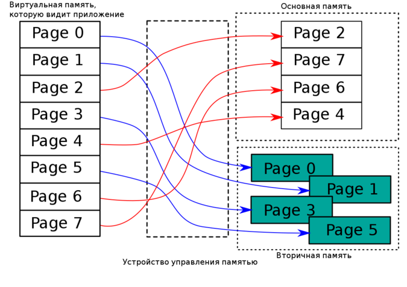
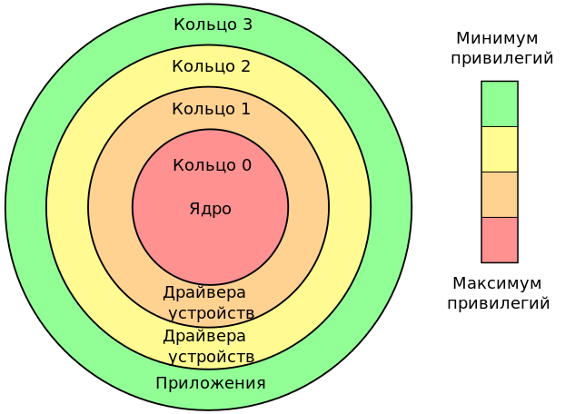

 МОСКОВСКИЙ ГОСУДАРСТВЕННЫЙ ТЕХНИЧЕСКИЙ УНИВЕРСИТЕТ ИМЕНИ Н.Э. БАУМАНА (НАЦИОНАЛЬНЫЙ ИССЛЕДОВАТЕЛЬСКИЙ УНИВЕРСИТЕТ)

# «Классификация методов модификации ядра Linux» 

<b>Студент:</b> Романов Семен Константинович

<b>Группа:</b> ИУ7-55Б
<b>Руководитель:</b> Оленев Антон Александрович

---

    
# <header>Цель и задачи
</header>

<b>Цель</b> – классифицировать методы модификации ядра Linux.

##### 
Задачи:
* Провести обзор существующих методов модификации ядра Linux;
* Провести анализ методов модификации ядра Linux;
* Сформулировать критерии классификации методов модификации ядра;
* Классифицировать существующие методы модификации ядра.

---

# <header>Термины предметной области
</header>

Ядро Linux — это основной компонент ОС Linux.

Ядро должно в первую очередь выполнять две основные задачи:

* Взаимодействие с аппаратными компонентами, обслуживая все низкоуровневые элементы, входящие в состав аппаратной платформы.
* Обеспечить среду выполнения для программ, которые будут выполняться в операционной системе.

---

    

# <header>Термины предметной области
</header>

Виртуальная память - это способ организации памяти, при котором процессору предоставляется не физические адреса, а виртуальные адреса, которые
в дальнейшем переводятся в физические адреса с помощью таблиц страниц.

---

    

# <header>Термины предметной области
</header>

Идея колец защиты заключается в том, что каждое кольцо имеет собственный набор инструкций, которые процесс на данном кольце защиты может выполнять, и чем ближе кольцо к нулевому, тем больше прав имеет процесс.

---

# <header>Задачи модификации ядра Linux
</header>

Примеры некоторых задач, которые должны быть решены на уровне ядра:

* Написание приложений с доступом к низкоуровневым ресурсам, которые не могут быть предоставлены другими способами.
* Реализация алгоритмов, которые должны быть выполнены с высокой точностью по времени и/или пространству
* Написание программ, которые должны быть доступны всем пользователям системы.
* Также следует перейти в пространство ядра, где накладные расходы, такие как смена пространств пользователь-ядро, становится неприемлемыми для эффективной или корректной работы программы.

---

# <header>Обзор методов модификации ядра Linux
</header>

## 
Перекомпиляция ядра

    

        Преимущества:
        <ul style="list-style-type: '+ '">
            <li> Скорость работы системы.
            <li> Универсальность
            <li> Начиная c версии 6.1 нативная поддержка Rust
        </lu>
    

    

        Недостатки:
        <ul style="list-style-type: '- '">
            <li> Необходимость перекомпиляции ядра для каждого нового модуля. 
            <li> Сложность добавления кода в ядро Linux.
            <li> Серьезный риск повредить систему
        </lu>
    

---

# <header>Обзор методов модификации ядра Linux
</header>

## 
Loadable Kernel Module

    

        Преимущества:
        <ul style="list-style-type: '+ '">
            <li> Динамическая загрузка
            <li> Экономия оперативной памяти
            <li> Облегченный способ отладки
        </lu>
    

    

        Недостатки:
        <ul style="list-style-type: '- '">
            <li> Увеличение времени загрузки системы
            <li> Проблемы со совместимостью
            <li> Штраф за фрагментацию
            <li> Риск повредить систему
        </lu>
    

---

# <header>Обзор методов модификации ядра Linux
</header>

## 
Kernel Live Patching

    

        Преимущества:
        <ul style="list-style-type: '+ '">
            <li> Обновление без перезагрузки системы.
            <li> Возможность автоматизации процесса
            <li> Обновления проходят быстро
        </lu>
    

    

        Недостатки:
        <ul style="list-style-type: '- '">
            <li> Сложность реализации
            <li> Ограниченность
            <li> Не все ядра поддерживают Live Patching
        </lu>
    

---

# <header>Обзор методов модификации ядра Linux
</header>

## 
extended Berkeley Packet Filter

    

        Преимущества:
        <ul style="list-style-type: '+ '">
            <li> Не изменяет исходный код ядра
            <li> Поддержка высокоуровневых языков
            <li> Динамическая загрузка
        </lu>
    

    

        Недостатки:
        <ul style="list-style-type: '- '">
            <li> Ограниченность
            <li> Проблемы с безопасностью
            <li> Развивающаяся технология
        </lu>
    

---

# <header>Классификация методов модификации ядра Linux
</header>

## 
Критерии сравнения методов модификации ядра

Критерий                |   Описание 
:-----                  |   :------
Производительность      |   Производительность программ
Безопасность            |   Наличие гарантии, что внесенный код не вызовет остановку системы
Скорость разработки     |   Является ли метод быстрым в разработке
Гибкость                |   Возможность метода подстроиться под любые поставленные задачи
Простота отладки        |   Является ли описанная модификация простой в отладке
Поддержка               |   Поддержка метода разработчиками ядра при его написании
Простота развёртывания  |   Является ли описанный метод простым в развёртывании на большом количестве машин

---

# <header>Классификация методов модификации ядра Linux
</header>

## 
Критерии сравнения методов модификации ядра

Критерий                |   Рекомпиляция    |   LKM     |   Live Patching   |   eBPF
:-----                  |   :------:        |   :------:|   :------:        |   :------:
Производительность      | :white_check_mark:  | :white_check_mark: | :white_check_mark: | :white_check_mark:
Безопасность            | :x:  | :x: | :x: | :white_check_mark: 
Скорость разработки     | :x:  | :white_check_mark: | :x: | :white_check_mark:
Гибкость                | :white_check_mark:  | :white_check_mark: | :x: | :x:
Простота отладки        | :x:  | :white_check_mark:/:x: | :x: | :white_check_mark:
Поддержка               | :white_check_mark:  | :white_check_mark: | :white_check_mark: | :x:
Простота развёртывания  | :x:  | :white_check_mark: | :white_check_mark: | :white_check_mark:

---

# <header>Выводы
</header>

## 
В ходе данной работы были изучены:

- методы модификации ядра Linux;
- критерии сравнения методов модификации ядра;
- основные принципы работы и преимущества каждого из методов.

Был выполнен обзор существующих методов модификации ядра Linux, проведен анализ их преимуществ и недостатков.

Были сформулированы критерии классификации методов модификации ядра Linux.
Была проведена классификация методов модификации ядра Linux по критериям, сформулированным в ходе работы.

